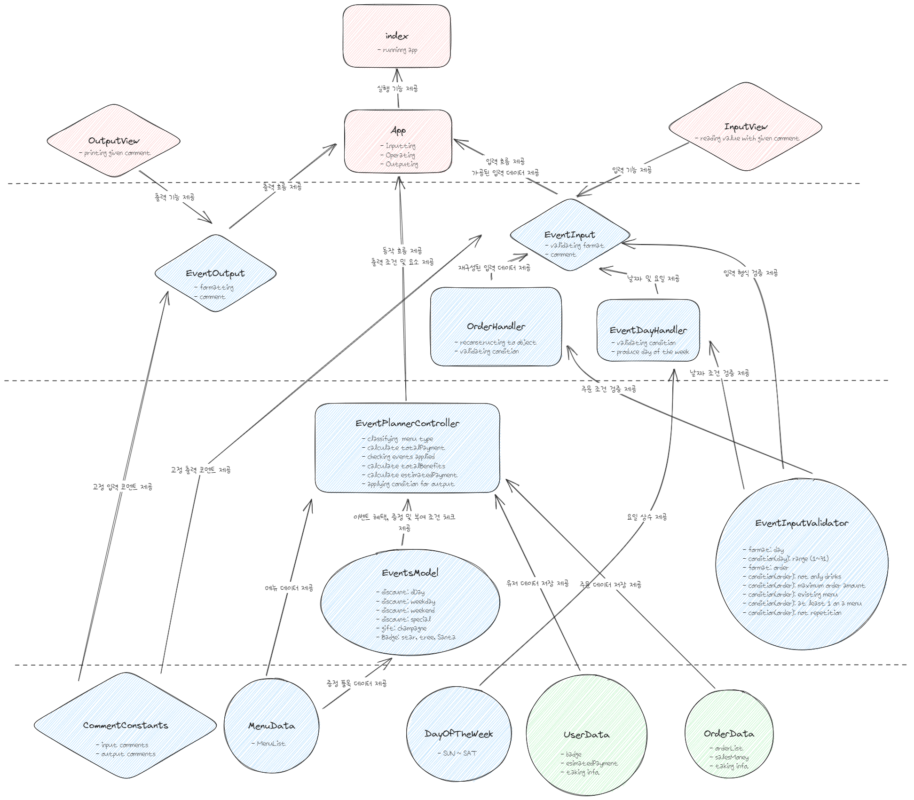

# 클래스 다이어그램 계획도

## 모양

- 마름모: view
- 원: model
- 직사각형: controller

## 계층 (위에서부터)

- player
- interface
- core operator
- data

## 다이어그램



<br>
<br>

# 개발 순서

- [x] 1. 이벤트 조건 (Events)
     - [x] 1-1. 요일 상수 (DayOfTheWeek)
     - [x] 1-2. D-day 할인
     - [x] 1-3. 평일 할인
     - [x] 1-4. 주말 할인
     - [x] 1-5. 스페셜 할인
     - [x] 1-6. 증정
     - [x] 1-7. 뱃지 부여
- [x] 2. 이벤트 적용 (EventPlanner)
  - [x] 2-1. 적용 가능 이벤트 체크
  - [x] 2-1. 혜택 내역 산출
- [x] 3. 주문한 메뉴 타입 분류 및 카운팅 (EventPlanner)
- [x] 4. 각종 산출 금액 계산 (EventPlanner)
  - [x] 4-1. 총혜택 금액 계산
  - [x] 4-2. 할인 전 총주문 금액 계산
  - [x] 4-3. 할인 후 예상 결제 금액 계산
- [x] 5. 주문 object로 변경 (OrderHandler)
- [x] 6. 주문 조건 검증 (EventInputValidator)
     - [x] 음료만 주문 불가능
     - [x] 존재하는 메뉴만 주문 가능
     - [x] 메뉴 주문 시 1개 이상 주문
     - [x] 메뉴 최대 20개까지 주문
     - [x] 중복 메뉴 입력 불가능
- [x] 7. 요일 산출 (EventDayHandler)
- [x] 8. 날짜 조건 검증 (EventInputValidator)
- [x] 9. 입력값 형식 검증 (EventInputValidator)
  - [x] 입력값 숫자형 및 정수 확인
  - [x] 메뉴이름과 수량을 '-'로 연결
  - [x] 메뉴 주문끼리 ','로 연결
  - [x] 메뉴 이름은 띄어쓰기 없는 한글
  - [x] 메뉴 수량은 숫자형
  - [x] 메뉴 수량은 정수형
- [x] 10. 메뉴 정보 저장 (MenuData)
- [x] 11. 출력관련 조건 체크 (EventPlanner)
- [x] 12. 입출력 고정 코멘트 저장 (CommentConstants)
- [x] 13. 입력기에 입력 값 반환 및 코멘트 인자 (InputView)
  - [x] EventInput 생성 및 흐름 조합
- [x] 14. 출력기에 코멘트 인자 (OutputView)
  - [x] EventOutput 생성 및 흐름 조합
- [x] 15. 애플리케이션 입력,동작,출력 흐름 실행 (App)
- [x] 16. 사용자 데이터 저장 (UserData)
- [x] 17. 주문 데이터 저장 (OrderData)

<br>
<br>

# 기능 목록

- 우선순위 따른 순서

- 일단 정리

## 실행자

### index

- App 실행

### App

- [x] 입력 흐름 실행
- [x] 동작 흐름 실행
- [x] 출력 흐름 실행

### OutputView

- [x] 주어진 코멘트 출력

### InputView

- [x] 주어진 코멘트와 함께 입력 받기

## 인터페이스

### EvnetOutput

> 기능

- [x] 출력 코멘트 저장
- [x] 출력 형식 맞추기

### EventInput

- [x] 입력 값 받아오기.
- [x] 검증기로 입력 값 형식 체크

### EventDayHandler

> 기능

- [x] 검증기로 날짜 조건 체크
- [x] 요일 산출

> 예외 상황

```bash
  요일 제대로 산출 된건지
```

### OrderHandler

> 기능

- [x] object형식으로 입력 재구조
- [x] 검증기로 주문 조건 체크

> 예외 상황

```bash
  object형식으로 적절하게 재구조 된건지 (주문 조건 맞게)
```

## 핵심 기능

### EventPlanner

> 기능

- [x] 주문한 메뉴 타입 분류

- [x] 할인 전 총주문 금액 계산

- [x] 적용 가능한 모든 이벤트 확인

  - [x] 총 주문 금액 10_000원 이상

- [x] 총혜택 금액 계산 및 판매 금액에 업데이트

  - 총혜택 금액 = 할인 금액의 합계 + 증정 메뉴의 가격

- [x] 할인 후 예상 결제 금액 계산 및 저장

  - 할인 후 예상 결제 금액 = 할인 전 총주문 금액 - 할인 금액

- [x] 이벤트 관련 출력 조건 적용

> 예외 상황

```bash
  주문한 메뉴 타입 분류
  적용 가능한 모든 이벤트
  총 주문 금액 체크
  이벤트 관련 출력 조건 (이벤트 적용따라)
```

### Events

#### 할인

> 기능

- [x] 디데이 할인 조건
  - [x] 날짜 의존
  - [x] 할인 금액 : 1_000+100\*(날짜-1)
- [x] 평일 할인
  - [x] 요일 의존 : 일~목
  - [x] 디저트 메뉴 의존
  - [x] 할인 금액: 디저트 주문 수 \* 2_023
- [x] 주말 할인
  - [x] 요일 의존 : 금,토
  - [x] 메인 메뉴 의존
  - [x] 할인 금액: 메인 주문 수 \* 2_023
- [x] 스페셜 할인

  - [x] 날짜 의존 (25일)
  - [x] 요일 의존 (일)
  - [x] 할인 금액: 1_000

> 예외 상황

```bash
  디데이 할인 조건 확인
  디데이 할인 금액 확인
  주중 할인 조건 확인
  주중 할인 금액 확인
  주말 할인 조건 확인
  주말 할인 금액 확인
  스페셜 할인 조건 확인
  스페셜 할인 금액 확인
```

#### 증정

> 기능

- [x] 할인 전 총 주문 금액 의존 : 할인 전 총 주문 금액 120_000원 이상
- [x] 증정 품목 : 샴페인 1개 (25_000원)

> 예외 상황

```bash
  증정 조건 확인
  증정 품목 확인
```

#### 부여

> 기능

- [x] 총 혜택 금액 의존 : 5_000원 이상, 10_000원 이상, 20_000원 이상
- [x] 배지 부여 : 별, 트리, 산타

> 예외 상황

```bash
5_000 미만 아무것도 없어야
5_000<= < 10_000 별
10_000<= < 20_000 트리
20_000<= 산타
```

### EventInputValidator

#### 형식 검증

- [x] 날짜 검증

  - [x] 숫자형
  - [x] 정수

- [x] 주문 검증

  - [x] 메뉴이름과 수량을 '-'로 연결
  - [x] 메뉴 주문끼리 ','로 연결
  - [x] 메뉴 이름은 띄어쓰기 없는 한글
  - [x] 메뉴 수량은 숫자형
  - [x] 메뉴 수량은 정수형

  > 예외 상황

  ```bash
  날짜
  문자형
  실수
  범위 밖

  주문
  수량을 - 이외로 연결
  주문끼리 , 이외려 연결
  메뉴 이름에 띄어쓰기
  메뉴 수량에 문자형
  메뉴 수량에 실수
  ```

#### 조건 검증

> 날짜 조건

- [x] 1~31 범위

> 예외 상황

```bash
  범위 밖 날짜
```

> 주문 조건

- [x] 음료만 주문 불가능
- [x] 존재하는 메뉴만 주문 가능
- [x] 메뉴 주문 시 1개 이상 주문
- [x] 메뉴 최대 20개까지 주문
- [x] 중복 메뉴 입력 불가능

> 예외 상황

```bash
  음료만 주문
  존재하지 않는 메뉴 주문
  0개나 -1개 등의 수량으로 주문
  20개 초과 주문
  메뉴 중복 입력
```

## 데이터

### DayOfTheWeek

> 기능

- [x] 날짜를 7로 나눈 나머지 값과 요일 대응되는 키와 값

### CommentData

> 기능

- [x] 고정 입력 코멘트 저장
- [x] 고정 출력 코멘트 저장
- [x] 입출력 포멧 저장

### MenuData

> 기능

- [x] 메뉴 종류를 object 형식으로 저장

<br>
<br>

# 추후 추가 예상 기능 목록

## 데이터

### UserData

> 기능

- [ ] 사용자의 뱃지 정보를 저장
- [ ] 사용자의 할인 후 예상 결제 금액 저장
- [ ] 데이터 업데이트 기능

### OrderData

> 기능

- [ ] object형식 주문 내용 저장
- [ ] 총 판매 금액 저장
  - 할인 후 예상 결제 금액이 더해짐
- [ ] 데이터 업데이트 기능
